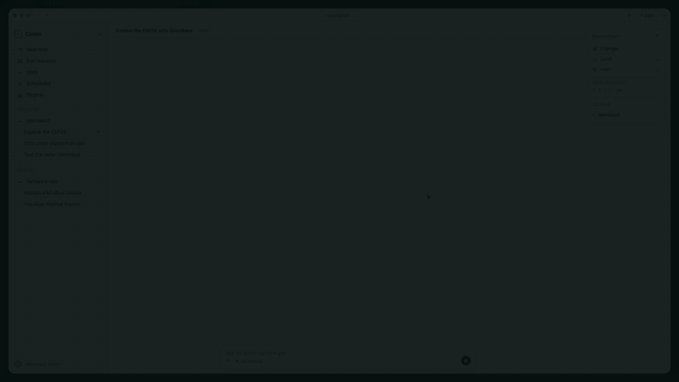

# OpenBaud

[](https://github.com/Leonezz/openbaud/actions/workflows/ci.yml)
[](https://github.com/Leonezz/openbaud/releases/latest)
[](LICENSE)

**Turn serial hardware into reusable, auditable tools for coding agents.**

OpenBaud gives Codex structured access to local serial devices. Inside an agent
task, it makes hardware actions visible and auditable, returns structured
results instead of byte dumps, and turns verified exploration into durable
tools. It combines an MCP server with device profiles, typed commands,
workflows, lossless captures, byte-exact replay, and a hardware-exploration
skill.



[Watch the 46-second PV](docs/assets/openbaud-pv.mp4) ·
[Try without hardware](examples/pv-demo/README.md) ·
[Install for Codex](#install-the-codex-plugin)

## Why OpenBaud

A serial terminal can send bytes. An ad-hoc script can make one device work.
OpenBaud keeps the evidence that makes the result repeatable:

- **Explore safely:** identify ports by USB metadata, frame responses, audit
  writes, and require explicit acknowledgement for dangerous commands.
- **Sediment knowledge:** turn verified behavior into typed, reviewable YAML
  commands and fixed workflows with provenance.
- **Parse real protocols:** validate checksums and decode scalars, bit fields,
  split lists, and record arrays into structured results.
- **Replay without hardware:** record every RX/TX byte in `.obcap`, then rerun
  the same command and parser against the capture.

```text
serial device → lossless capture → checksum → typed parse → command → replay
```

## Real ESP32 demo

The product video uses a physical ESP32-S3 development board running a new
binary protocol, **OBP/1**. OpenBaud recorded eight hardware exchanges and
decoded every 196-byte response into 36 polar points with CRC-16 verification.

The USB transport, board timestamps, frames, captures, and parsing are real.
The radar scene is generated by the test firmware, and that fact is declared on
the wire as `simulated_scene: 1`.

Run the exact parser against the included real-device capture:

```sh
cargo run --locked -p openbaud -- run openbaud-pv-board/obp1_radar_scan \
  --workspace examples/pv-demo \
  --port replay:captures/obp1-radar-seq42.obcap \
  --set seq=42
```

Expected result: `outcome: normal`, `seq: 42`, `point_count: 36`, and 36
decoded `{angle_deg, distance_mm, intensity}` records. The
[example workspace](examples/pv-demo/) includes the command, protocol layout,
and lossless capture.

## Install the Codex plugin

Register this Git repository as the `openbaud-marketplace` marketplace and
install its plugin:

```sh
codex plugin marketplace add Leonezz/openbaud
codex plugin add openbaud@openbaud-marketplace
```

Start a new Codex task, connect a serial device, then ask:

```text
Use OpenBaud to identify this serial device. Start read-only, preserve a
capture, and turn verified behavior into reusable commands.
```

The plugin bundles its native MCP runtime; users do not need Rust, Cargo,
Homebrew, or an install hook. The Git marketplace checkout currently bundles
macOS Apple Silicon. The latest GitHub Release additionally publishes
self-contained marketplace archives for macOS Intel, Linux x64/ARM64, and
Windows x64. macOS binaries are ad-hoc signed for preview distribution but are
not yet Apple-notarized.

To pin the current release rather than follow the default branch:

```sh
codex plugin marketplace add Leonezz/openbaud --ref v0.2.0
codex plugin add openbaud@openbaud-marketplace
```

See [plugins/openbaud/README.md](plugins/openbaud/README.md) for platform
archives, upgrade instructions, packaging details, and smoke tests.

## Knowledge format

An OpenBaud workspace keeps device knowledge next to the project:

```text
devices/<device>/profile.yaml
devices/<device>/commands/*.yaml
devices/<device>/workflows/*.yaml
devices/<device>/notes.md
captures/*.obcap
.openbaud/audit.jsonl
```

The `schema` MCP tool and `openbaud schema` CLI command are the authority for
the current profile, command, and workflow formats.

## Build and verify

```sh
cargo test --workspace
python3 scripts/validate-package.py
plugins/openbaud/scripts/build-runtime
plugins/openbaud/scripts/smoke-test
```

GitHub Actions runs Clippy, package validation, native builds, tests, archive
verification, and real MCP smoke tests on macOS ARM64/Intel, Linux x64/ARM64,
and Windows x64. Stable `vMAJOR.MINOR.PATCH` tags publish all five platform
archives plus SHA-256 files.

The Remotion source and real capture used to produce the public video live in
[media/pv](media/pv/). Regenerate its data with `pnpm extract`, preview with
`pnpm studio`, and render with `pnpm render`.

## Safety

Serial writes can reconfigure or actuate physical hardware. OpenBaud marks raw
writes and device commands as potentially destructive MCP operations, keeps an
append-only audit, and requires explicit acknowledgement for commands declared
with `risk: danger`. Start unknown devices read-only and preserve a recovery
path before changing state.

## License

MIT
